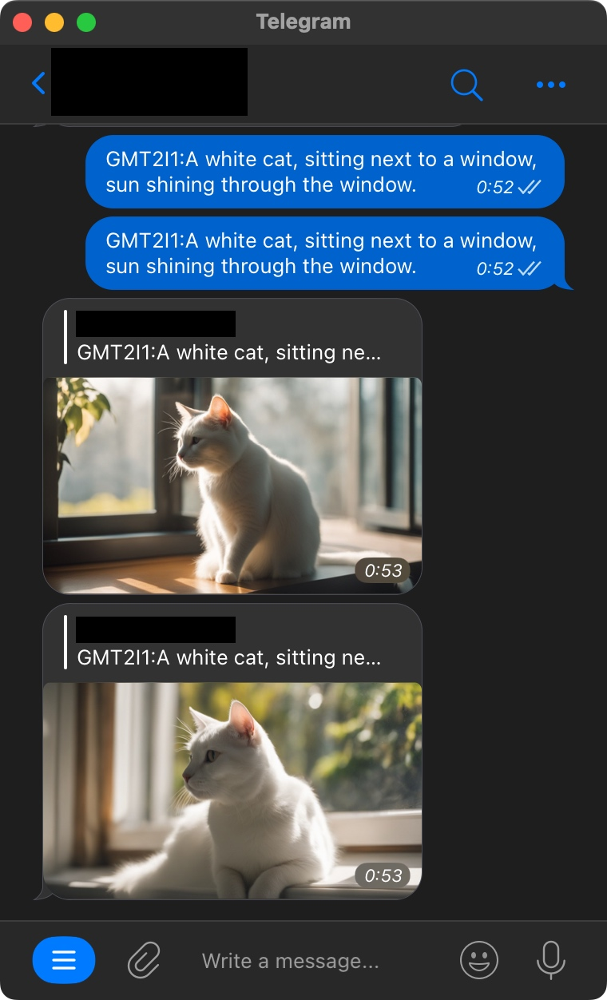

# Make sure to set API key and endpoint ID before running the script.
# SDXL_Serverless_Runpod

## 1. Introduction
This is a serverless application that uses [Stable Diffusion XL](https://stability.ai/stable-diffusion) to run a Text-to-Image task on [RunPod](https://www.runpod.io/).

Serverless means that you are only charged for the time you use the application, and you don't need to pay for the idle time, which is very suitable for this kind of application that is not used frequently but needs to respond quickly.

Theoretically, this application can be called by any other application. Here we provide two examples:
1. A simple Python script
2. A Telegram bot

See [Usage](#Usage) below for more details.

### Example Result:
Input Prompt:
```
A beautiful white cat, looking at the viewer, sitting next to a window, sun shining through the window.
```

Faster Result:
(20 steps, 1024x576, around 15 seconds on RTX 3090, 0.004$😱 on RunPod)


Better Result:
(40 steps, 1280x960, around 25 seconds on RTX 3090, 0.007$😱 on RunPod)


#### Time Measurement Explanation:
The time is measured from the moment the input prompt is sent to the moment the result image is received, including the time for all the following steps:
- Receive the request from the client
- Serverless container startup
- Model loading
- Inference
- Sending the result image back to the client.

## 2. Dependencies
- Python >= 3.9.7
- Docker
- Local GPU is necessary for testing but not necessary for deployment. (Recommended: RTX 3090)

If you don't have a GPU, you can modify and test the code on [Google Colab](https://colab.research.google.com/) and then build and deploy the application on RunPod.

<a id="Usage"></a>
## 3. Usage
#### 1. Test on Local Machine
```
# Install dependencies
pip install -r requirements.txt

# Download models
python script/download.py

# Edit (or not) config to customize your inference
edit preset_prompts.json if your want to customize your prompt

# Run inference test
python inference_util.py

# Run server.py local test
python server.py
```

#### 2. Deploy on RunPod
1. First, make sure you have installed Docker and have accounts on both DockerHub and RunPod.

2. Then, decide a name for your Docker image, e.g., "your_username/sdxl:v1" and set your image name in "./scripts/build.sh".

3. Run the following commands to build and push your Docker image to DockerHub.

bash scripts/build.sh


4. Finally, deploy your application on RunPod to create [Template](https://docs.runpod.io/docs/template-creation) and [Endpoint](https://docs.runpod.io/docs/autoscaling).

Sorry for not providing detailed instructions here as the author is quite busy recently. You can find many detailed instructions on Google about how to deploy a Docker image on RunPod.

Feel free to contact me if you encounter any problems after searching on Google.

#### 3. Call the Application
##### Call from a Python script
```
# Make sure to set API key and endpoint ID before running the script.
python test_client.py
```

##### Showcase: Call from a Telegram bot


## 4. TODO
- [ ] Support custom models
- [ ] More detailed instructions
- [ ] One-click deploy (If anyone is interested...)

## 4. Acknowledgement
Thanks to [Stable Diffusion XL](https://stability.ai/stable-diffusion) and [RunPod](https://www.runpod.io/).